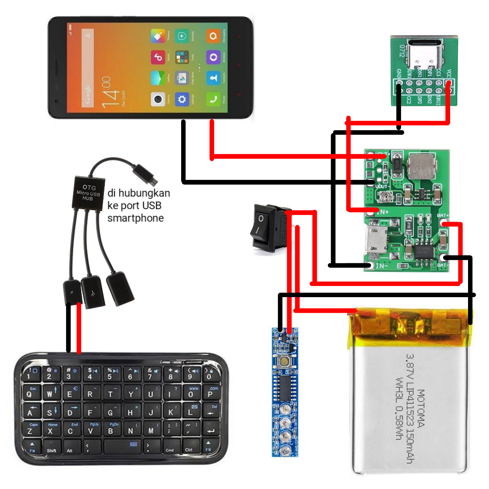
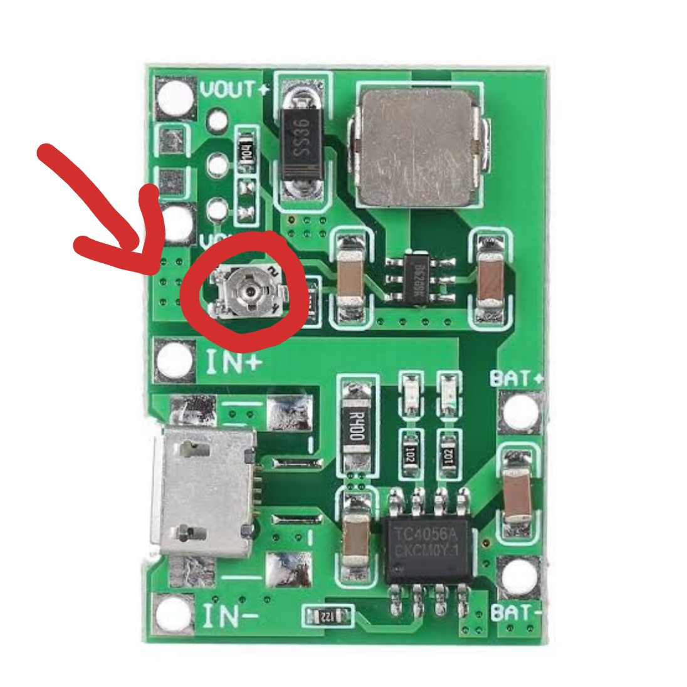
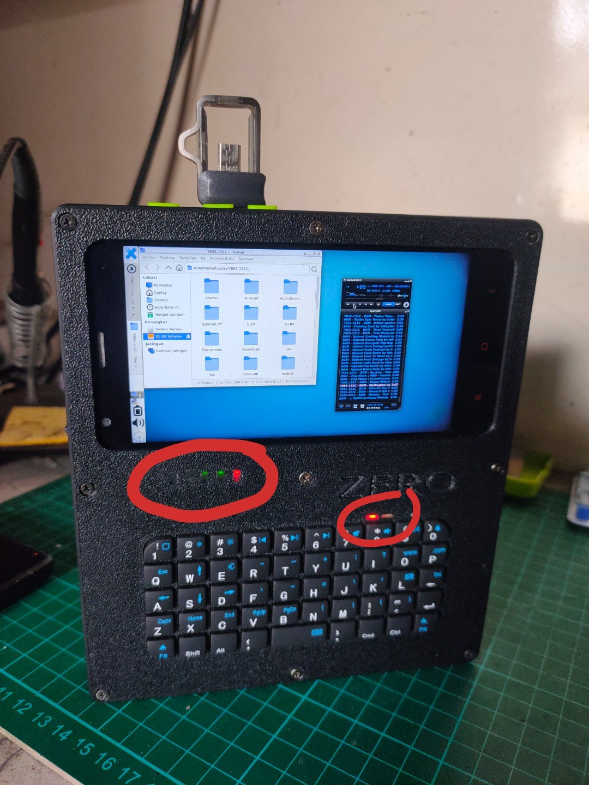

# Cara Merakit HaPlay GO Zero 1
Untuk dapat merakit sendiri HaPlay GO Zero 1, dibutuhkan sedikit pengetahuan dan keahlian teknis seputar elektronika. Seperti menyolder, menggunakan AVO meter dan bisa membaca kode input dan output pada papan PCB.

Juga, sedikit keahlian dalam menggunakan sistem operasi Linux sangat diperlukan dalam pembentukan image PostmarketOS dan flashing custom firmware pada smartphone.

## Persiapan dan Bahan
Pengerjaan HaPlay GO Zero 1 memerlukan persiapan dan bahan sebagai berikut.

* **INFO**: *Setiap pembelian yang kamu lakukan melalui link di bawah ini, kami akan mendapat sedikit, sangat sedikit komisi yang akan digunakan untuk biaya pengembangan selanjutnya.*

### Peralatan
- [1x Solder](https://s.shopee.co.id/60Dj735rdw)
- [1x Obeng Kecil](https://s.shopee.co.id/5fasiUem6q)
- [1x Avo Meter](https://s.shopee.co.id/60Dj79PVWe)
- [1x Pinset](https://s.shopee.co.id/7V2Wu1YZIR)
- [1x PCB Holder](https://s.shopee.co.id/wVyJQNrr)
- [1x Tang Potong](https://s.shopee.co.id/7fLx6R0JAs)
- [1x Linux Komputer](https://s.shopee.co.id/3fpoLJ155m)

### Bahan
- [Timah Solder](https://s.shopee.co.id/4q1ljUhofo)
- [Flux/ Pasta Solder](https://s.shopee.co.id/7pfNJ4Lyq9)
- [1 Meter Kabel AWG 30](https://s.shopee.co.id/9pQRgyw0Ah)
- [30x Baut Flat Head M2x6](https://s.shopee.co.id/6pmq7XVeg4)
- [9x Insert Knur/ Mur Tanam M2x3](https://s.shopee.co.id/3VWO9TTfRL)
- [1x TP4056 + Stepup](https://s.shopee.co.id/7Kj6ibDT0l)
- [1x USB Type-C Breakout Board](https://s.shopee.co.id/9f71UwKUR0)
- [1x Micro USB HUB 2 Port 1 Charging Port](https://s.shopee.co.id/1g4jyMYn0m)
- [1x Mini Saklar](https://s.shopee.co.id/3AtXlAsGWm)
- [1x Baterai Polimer](https://s.shopee.co.id/9pQRi9ncPN)
- [1x Baterai Level Indikator](https://s.shopee.co.id/9AAkv68Wnd)
- [1x Bluetooth Keyboard](https://s.shopee.co.id/9KUB7YdjMu)
- [1x Resistor 1K Ω](https://s.shopee.co.id/30a7ZyZYIW)
- [1x MicroSD 32GB](https://s.shopee.co.id/2B10aVomzX)
- [1x Lem Araldite](https://s.shopee.co.id/3q9EZdu1nQ)
- [1x Glue Gun](https://s.shopee.co.id/5VHSYlcr5i)
- [1x Xiaomi Redmi 2 Prime](https://s.shopee.co.id/4L5VAmCNT7)

## Diagram Pengkabelan


**!!! PERINGATAN !!!**

*PROSES PERAKITAN HAPLAY GO ZERO MODEL 1 INI MELIBATKAN PENGGUNAAN BATERAI POLIMER YANG BERESIKO TINGGI DAN MEMERLUKAN PENANGANAN KHUSUS. JIKA TERJADI KESALAHAN KONTAK ATAU TEKANAN FISIK YANG TIDAK DISENGAJA DAPAT MENYEBABKAN BATERAI TERBAKAR ATAU MELEDAK.*

___

HaPlay GO Zero 1 di rakit menggunakan modul elektronika yang sederhana, yang pada intinya, modul-modul tersebut hanya bekerja untuk menangani daya.

Berikut ini adalah diagram jalur pengkabelan HaPlay GO Zero 1.



Setelah dirakit, panel bagian depan terlihat seperti ini.


Sedangkan panel bagian belakang terlihat seperti ini.


## Catatan Modul Charging
HaPlay GO Zero 1 menggunakan modul charging TP4056 yang terintegrasi dengan modul micro step-up, sehingga arus keluaran harus di atur manual.

Untuk mengatur arus keluaran, putar potensiometer lalu periksa menggunakan AVO meter sampai mendapatkan nilai 4.2V.



## Bypass Baterai
HaPlay GO Zero 1 menggunakan baterai eksternal yang di isi dan diatur oleh modul mandiri, sehingga pin baterai, harus di bypass agar dapat menerima daya dari luar.

Bypass baterai dilakukan dengan satu Resistor bernilai 1K ohm yang di solder pada pin **GND**, **Temp** dan **BSI**.


## Keyboard MOD
HaPlay GO Zero 1 menggunakan keyboard bluetooth tanpa dongle yang dimodifikasi agar dapat menerima masukan daya sebesar 5V.

Modifikasi keyboard diadopsi dari proyek [Decktility](https://github.com/ByteWelder/Decktility) oleh [Byte Welder](https://github.com/ByteWelder). Lihat modifikasinya disini: [Decktility Keyboard Mod](https://github.com/ByteWelder/Decktility/blob/main/docs/assembling.md#keyboard-mod)

## Keyboard Remaping
HaPlay GO Zero 1 menggunakan keyboard yang tidak memiliki tombol `TAB` khusus, dimana tombol `TAB` ini sangat penting untuk mengoperasikan sistem operasi Linux yang digunakan pada HaPlay GO Zero 1, terutama bagi pengguna perintah baris.

Karena itulah, HaPlay GO Zero 1 melakukan remap keyboard dengan merubah fungsi `Caps Lock` menjadi fungsi `TAB`.

Keyboard remap ini diadopsi dari proyek [Micro 2](https://yarh.io/yarh-io-m2.html) oleh [YARH IO](https://yarh.io).

## Casing


Casing HaPlay GO Zero 1 dicetak melalui jasa print 3D online yang banyak tersedia di platform online shop dengan pengaturan sebagai berikut:

- Layer 0.2
- Bahan ABS

[Download disain 3D](../stl)

- CATATAN: Terdapat cacat pada disain 3D yang saya buat. Yaitu, lubang jack 3.5mm untuk output audio tidak simetris. Jika ingin menggunakannya, kamu bisa perbaiki ini sebelum dicetak.

### Kegunaan Lem Araldite dan Lem Bakar (Glue Gun)
Lem Araldite di gunakan untuk menutup lubang indikator baterai, lubang indikator keyboard, dan lubang indikator charging.



Karena sifat lem Araldite yang transparan, ini membuat lampu indikator tetap terlihat terang.

Sedangkan lem bakar, digunakan untuk merekatkan kabel bagian dalam setelah dirakit agar lebih rapi.

## Menyiapkan Sistem Operasi
HaPlay GO Zero 1 menggunakan sistem operasi [PostmarketOS Linux](https://postmarketos.org) sebagai pengganti [Android OS](https://android.com) dengan konfigurasi dan pemasangan khusus.

Pada proses ini diperlukan sebuah komputer Linux dan pengetahuan mendalam tentang sistem operasi Linux dan management disk agar tidak terjadi masalah.

* **INFO**: *Saya menggunakan sistem operasi Debian Linux untuk membangun image PostmarketOS Linux. Jika Kamu menggunakan distro berbeda, silahkan disesuaikan*
* **CATATAN**: *Pemasangan PostmarketOS Linux pada HaPlay GO Zero 1 dilakukan sebelum semua bagian di rakit.*

### Pembentukan PostmarketOS
Dari terminal emulator, pasang program pembentuk image PostmarketOS dengan perintah:

```
~$ sudo apt install pmbootstrap fastboot
```

Kemudian inisialisasi perangkat dengan perintah:

```
~$ pmbootstrap init
```

Isi beberapa nilai seperti ini:
* **Versi**: v24.06
* **Brand**: Xiaomi
* **Model**: wt88047
* **GUI**: none
* **Paket Extra**: nano,networkmanager,networkmanager-tui,networkmanager-wifi,networkmanager-wwan,hidapi
* **Username**: haplay
* **Host**: go-zero

Setelah initialisasi, bentuk semua paket menjadi image siap pasang dengan perintah:

```
~$ pmbootstrap install
```

* Masukan sandi sudo pada permintaan pertama.
* Masukan sandi baru untuk user *haplay* pada permintaan kedua.

Dengan konfigurasi ini, image PostmarketOS yang dihasilkan akan berukuran sangat kecil. Tidak lebih dari 200MB.

### Instalasi PostmarketOS Linux
* **CATATAN**: *Untuk kelancaran pemasangan sistem operasi PostmarketOS Linux, diperlukan pengetahuan yang cukup mendalam mengenai flashing pada smartphone Android.*

Masuk ke mode fastboot dengan menekan tombol kombinasi Volume `-` dan tombol Power secara bersamaan. Kemudian hubungkan smartphone ke komputer melalui kabel data USB.

Beralih ke komputer, periksa status hubungan dengan perintah:

```
~$ fastboot devices
```

Jika umpan balik tidak kosong, lanjutkan dengan menjalankan perintah:

```
~$ pmbootstrap flasher flash_lk2nd
```

Kemudian restart smartphone:

```
~$ fastboot reboot
```

Saat restart, smartphone akan bergetar dua kali dengan jeda pendek. Tekan tombol volume `-` setelah getar pertama untuk masuk ke mode fastboot LK2ND.

Dari mode fastboot LK2ND, dan smartphone masih terhubung ke komputer, jalankan perintah pemasangan PostmarketOS Linux:

```
~$ pmbootstrap flasher flash_rootfs --partition system
```

Kemudian restart smartphone dan biarkan masuk ke sistem.

```
~$ fastboot reboot
```

### Menyiapkan Sistem Operasi
Setelah smartphone berhasil menjalankan PostmarketOS Linux dalam mode teks, login dengan informasi yang diatur sebelumnya saat pembentukan image.

* Username: haplay
* Password: <*masukan sandi yang diatur tadi*>

Kemudian login sebagai root:

```
~$ sudo su
```

Atur agar **Network Manager** berjalan saat boot:

```
~# rc-update add networkmanager default
```

### Menyiapkan Partisi
**!!! PERINGATAN !!!**

*BERIKUT INI ADALAH LANGKAH YANG PENTING DAN DAPAT MENYEBABKAN KERUSAKAN SOFTWARE JIKA TRRJADI SALAH PROSEDUR*

Pada langkah ini, kita akan menggabung MicroSD sebagai partisi sistem dan mengatur lingkungan desktop. Jadi pastikan jika MicroSD sudah terpasang di tempatnya.

Periksa daftar partisi yang ada:

```
~# parted -l
```

Temukan partisi dengan nama `userdata` lalu catat nomor di depannya. Katakanlah partisi tersebut bernomor **30**.

Format partisi *userdata*:

```
~# mkfs.ext4 -L USRFS /dev/mmcblk0p30
```

Format MicroSD:

```
~# mkfs.ext4 -L HOMEFS /dev/mmcblk1p1
```

Mount partisi **userdata** dan **MicroSD**:

~~~
~# mkdir /mnt/usrfs
~# mkdir /mnt/homefs
~# mount /dev/mmvblk0p30 /mnt/usrfs
~# mount /dev/mmcblk1p1 /mnt/homefs
~~~

Salin semua berkas dari direktori `/usr` kedalam partisi **userdata**:

```
~# cp -av /usr/* /mnt/usrfs/
```

Salin semua berkas dari direktori `/home` kedalam MicroSD:

```
~# cp -av /home/* /mnt/homefs/
```

Buat raw disk image sebesar 10GB di dalam MicroSD:

```
~# dd if=/dev/zero of=/mnt/homefs/varfs bs=1MB count=10000
```

Format raw disk image **varfs** yang baru dibuat:

```
~# mkfs.ext4 -L VARFS /mnt/homefs/varfs
```

Mount disk image **varfs** lalu salin isi direktori `/var` kedalamnya:

~~~
~# mkdir /mnt/varfs
~# mount /mnt/homefs/varfs /mnt/varfs
~# cp -av /var/* /mnt/varfs/
~~~

Edit file `/etc/fstab`:

```
~# nano /etc/fstab
```

Lalu tambah baris seperti ini:

```
/dev/mmcblk1p1 /home ext4 defaults 0 0
/dev/mmcblk0p30 /usr ext4 defaults 0 0
/home/varfs /var ext4 defaults 0 0
```

Simpan dengan menekan tombol `CTRL` + `O` lalu `CTRL` + `X` dan restart.

```
~# reboot
```

Setelah menyala kembali, login lalu jalankan perintah:

```
~$ df -h
```

Jika pada umpan baliknya kamu melihat `/dev/loopxx` di awal baris bawah, maka pengaturan yang dilakukan telah berhasil dan saatnya untuk memasang lingkungan desktop.

### Memasang Lingkungan Desktop GUI
Setelah semua pengaturan berjalan dengan baik, selanjutnya adalah memasang lingkungan desktop. Pada HaPlay GO Zero 1, awalnya, desktop yang digunakan adalah KDE Plasma Desktop. Namun karena KDE Plasma Desktop mengalami lag meski cukup lancar, namun hal tersebut membuat kesan jika HaPlay GO Zero 1 lambat saat dioperasikan.

Jadi, sekarang, HaPlay GO Zero 1 mengganti default desktopnya dengan XFCE4.

Hubungkan HaPlay GO Zero 1 ke jaringan:

```
~$ sudo nmtui-connect
```

Update dan upgrade paket dulu:

```
~$ sudo apk update && sudo apk upgrade
```

Install XFCE4:

```
~$ sudo apk add postmarketos-ui-xfce4 \
xfce4-notifyd xfce4-pulseaudio-plugin \
xfce4-terminal thunar pavucontrol gvfs \
udiskie udisks2 xarchiver 7zip \
network-manager-applet
```

Atur rotasi layar dengan perintah:

```
~$ sudo nano /etc/udev/rules.d/98-touchscreen-cal.rules
```

Lalu tulis parameter ini didalamnya:

```
ATTRS{name}=="generic ft5x06 (8d)", ENV{LIBINPUT_CALIBRATION_MATRIX}="0 1 0 -1 0 1"
```

Atur device daemon ke layanan **udev**:

```
~$ sudo setup-devd udev
```

Masukan *haplay* ke dalam *grup* `plugdev`:

```
~$ sudo adduser haplay plugdev
```

Masukan modul *uhid* ke kernel load:

```
~$ sudo echo "uhid" >> /etc/modules
```

Bersihkan cache lalu restart.

```
~$ sudo apk cache clean && reboot
```

Terakhir, buka **Pengaturan** -> **Layar** dan ubah rotasi layar ke **Kanan**, simpan.

Buka **Pengaturan** -> **Bluetooth** -> lalu ketuk tombol `+`, tekan menggunakan SIM Card Ejector pada lubang di sebelah lampu keyboard hingga lampu biru berkedip.

Kemudian pada jendela Bluetooth, pilih **Keyboard**, lalu ketuk lanjutkan untuk menghubungkan keyboard, dan selesai.

# Beli HaPlay GO Zero 1
Jika proses merakit HaPlay GO Zero 1 terasa rumit, kamu bisa membelinya langsung dari [DHOCNET Store](https://dhocnet.work/search?label=Produk) atau [DHOCNET Store Tokopedia](https://tokopedia.com/dhocnet).

Dengan membeli produk [HaPlay Computer](https://dhocnet.work/p/haplay.html), berarti kamu telah membantu tim kecil kami mendapat dana untuk biaya pengembangan dan sekaligus kamu juga telah turut berpartisipasi dalam proyek *Reuse & Recycle* untuk menggunakan elektronik konsumen lebih lama guna mengurangi bertambahnya sampah elektronik, terutama yang berjenis smartphone.

- CATATAN: Pembelian melalui Tokopedia dikenakan biaya layanan sebesar 12% dari harga barang.
