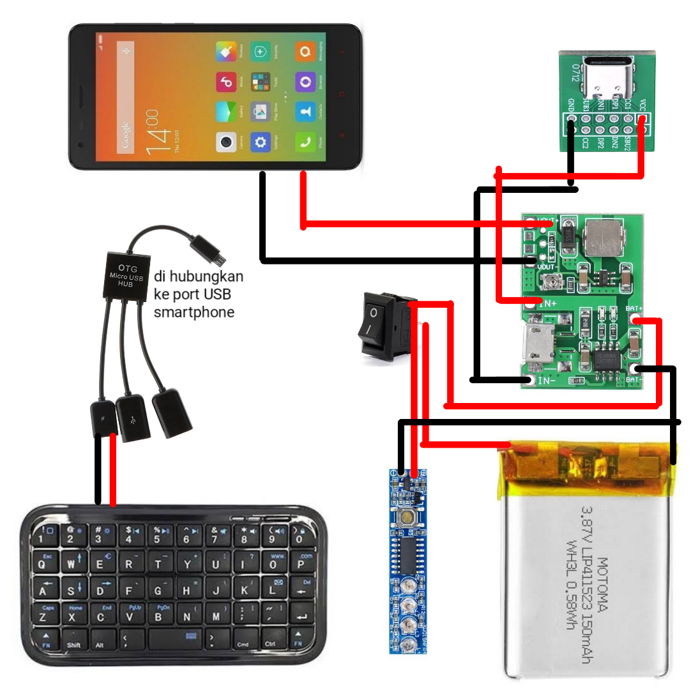

# Cara Merakit HaPlay GO Zero 1
Untuk dapat merakit sendiri HaPlay GO Zero 1, dibutuhkan sedikit pengetahuan dan keahlian teknis seputar elektronika. Seperti menyolder, menggunakan AVO meter dan bisa membaca kode input dan output pada papan PCB.

Juga, sedikit keahlian dalam menggunakan sistem operasi Linux sangat diperlukan dalam pembentukan image PostmarketOS dan flashing custom firmware pada smartphone.

## Persiapan dan Bahan
Pengerjaan HaPlay GO Zero 1 memerlukan persiapan dan bahan sebagai berikut.

### Peralatan
- 1x Solder
- 1x Obeng Kecil
- 1x Avo Meter
- 1x Pinset
- 1x PCB Holder
- 1x Tang Potong
- 1x Linux Komputer

### Bahan
- Timah Solder
- Flux/ Pasta Solder
- 1 Meter Kabel AWG 30
- 30x Baut Flat Head M2x6
- 9x Insert Knur/ Mur Tanam M2x3
- 1x TP4056 + Stepup
- 1x USB Type-C Breakout Board
- 1x Micro USB HUB 2 Port 1 Charging Port
- 1x Mini Saklar
- 1x Baterai Polimer
- 1x Baterai Level Indikator
- 1x Bluetooth Keyboard
- 1x Resistor 1K Ω
- 1x MicroSD 32GB
- 1x Lem Araldite

## Diagram Pengkabelan
HaPlay GO Zero 1 di rakit menggunakan modul elektronika yang sederhana, yang pada intinya, modul-modul tersebut hanya bekerja untuk menangani daya.

Berikut ini adalah diagram jalur pengkabelan HaPlay GO Zero 1.

Setelah dirakit, panel bagian depan terlihat seperti ini.

Sedangkan panel bagian belakang terlihat seperti ini.

## Catatan Modul Charging
HaPlay GO Zero 1 menggunakan modul charging TP4056 yang terintegrasi dengan modul micro step-up, sehingga arus keluaran harus di atur manual.

Untuk mengatur arus keluaran, putar potensiometer lalu periksa menggunakan AVO meter sampai mendapatkan nilai 4.2V.

## Bypass Baterai
HaPlay GO Zero 1 menggunakan baterai eksternal yang di isi dan diatur oleh modul mandiri, sehingga pin baterai, harus di bypass agar dapat menerima daya dari luar.

Bypass baterai dilakukan dengan satu Resistor bernilai 1K ohm yang di solder pada pin **GND**, **Temp** dan **BSI**.

## Keyboard MOD
HaPlay GO Zero 1 menggunakan keyboard bluetooth tanpa dongle yang dimodifikasi agar dapat menerima masukan daya sebesar 5V.

Modifikasi keyboard diadopsi dari proyek [Decktility](https://github.com/ByteWelder/Decktility) oleh [Byte Welder](https://github.com/ByteWelder). Lihat modifikasinya disini: [Decktility Keyboard Mod](https://github.com/ByteWelder/Decktility/blob/main/docs/assembling.md#keyboard-mod)

## Casing
Casing HaPlay GO Zero 1 dicetak melalui jasa print 3D online yang banyak tersedia di platform online shop dengan pengaturan sebagai berikut:

- Layer 0.2
- Bahan ABS

[Download disain 3D](../stl)

- CATATAN: Terdapat cacat pada disain 3D yang saya buat. Yaitu, lubang jack 3.5mm untuk output audio tidak simetris. Jika ingin menggunakannya, kamu bisa perbaiki ini sebelum dicetak.

# Beli HaPlay GO Zero 1
Jika proses merakit HaPlay GO Zero 1 terasa rumit, kamu bisa membelinya langsung dari [DHOCNET Store](https://dhocnet.work/search?label=Produk) atau [DHOCNET Store Tokopedia](https://tokopedia.com/dhocnet).

Dengan membeli produk [HaPlay Computer](https://dhocnet.work/p/haplay.html), berarti kamu telah membantu tim kecil kami mendapat dana untuk biaya pengembangan dan sekaligus kamu juga telah turut berpartisipasi dalam proyek *Reuse & Recycle* untuk menggunakan elektronik konsumen lebih lama guna mengurangi bertambahnya sampah elektronik, terutama yang berjenis smartphone.

- CATATAN: Pembelian melalui Tokopedia dikenakan biaya layanan sebesar 12% dari harga barang.
